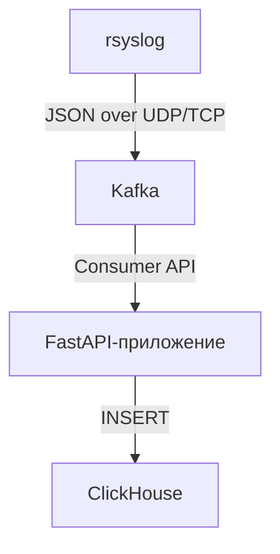

# Архитектура и основные компоненты

## Общая схема

1. **rsyslog** — собирает логи с серверов, форматирует их в JSON и отправляет в Kafka.
2. **Kafka** — брокер сообщений, обеспечивает буферизацию и доставку логов.
3. **FastAPI-приложение** — сервис, который при запуске автоматически стартует consumer:
    - Читает сообщения из Kafka
    - Преобразует и валидирует данные
    - Записывает логи в ClickHouse
4. **ClickHouse** — высокопроизводительная аналитическая СУБД, хранит структурированные логи для последующего анализа.

## Взаимодействие компонентов



- **rsyslog** формирует сообщения в нужном формате и отправляет их в Kafka.
- **Kafka** хранит сообщения до тех пор, пока FastAPI-приложение не прочитает их.
- **FastAPI-приложение** запускает consumer в отдельном потоке при старте и пишет данные в ClickHouse.
- **ClickHouse** обеспечивает быстрый поиск и аналитику по логам.

---

# Инструкция по настройке и запуску

## Установка rsyslog

```bash
sudo apt install rsyslog
```

## Настройка rsyslog для отправки логов в Kafka

1. **Добавьте необходимые модули** в `/etc/rsyslog.conf`:

```conf
module(load="imudp")
module(load="omkafka")
```

2. **Настройте входящий UDP-порт:**

```conf
input(type="imudp" port="514")
```

3. **Создайте шаблон для форматирования сообщений:**

```conf
template(name="JsonTemplate" type="list") {
    constant(value="{")
    constant(value="\"message\":\"")
    property(name="msg" format="json")
    constant(value=",\"hostname\":\"")
    property(name="hostname")
    constant(value=",\"timestamp\":\"")
    property(name="timereported" dateFormat="rfc3339")
    constant(value="\"}\n")
}
```

4. **Настройте отправку в Kafka:**

```conf
action(type="omkafka"
    topic="rsyslog-output"
    broker=["kafka:9092"]
    template="JsonTemplate")
```

---

## Создание таблиц в ClickHouse

Перед запуском парсера необходимо вручную создать дистрибутивную реплицированную таблицу для хранения логов.

### Пример для кластера из 4-х нод:

#### node1
```sql
CREATE DATABASE shard;
CREATE TABLE shard.logs (
    message String,
    hostname String,
    timestamp DateTime64(6, 'UTC')
) ENGINE = ReplicatedMergeTree('/clickhouse/tables/shard1/logs', 'replica_1')
ORDER BY timestamp;

CREATE TABLE default.logs AS shard.logs ENGINE = Distributed('my_cluster', '', logs, rand());
```

#### node2
```sql
CREATE DATABASE replica;
CREATE TABLE replica.logs (
    message String,
    hostname String,
    timestamp DateTime64(6, 'UTC')
) ENGINE = ReplicatedMergeTree('/clickhouse/tables/shard1/logs', 'replica_2')
ORDER BY timestamp;
```

#### node3
```sql
CREATE DATABASE shard;
CREATE TABLE shard.logs (
    message String,
    hostname String,
    timestamp DateTime64(6, 'UTC')
) ENGINE = ReplicatedMergeTree('/clickhouse/tables/shard2/logs', 'replica_1')
ORDER BY timestamp;

CREATE TABLE default.logs AS shard.logs ENGINE = Distributed('my_cluster', '', logs, rand());
```

#### node4
```sql
CREATE DATABASE replica;
CREATE TABLE replica.logs (
    message String,
    hostname String,
    timestamp DateTime64(6, 'UTC')
) ENGINE = ReplicatedMergeTree('/clickhouse/tables/shard2/logs', 'replica_2')
ORDER BY timestamp;
```

**Описание полей:**
- `message` — текст сообщения
- `hostname` — имя хоста
- `timestamp` — временная метка (DateTime64 с микросекундами)

> **Важно:** Убедитесь, что используете подходящий тип и порядок сортировки для ваших задач.

## Отправить данные в Clickhouse

```bash
curl -X POST "http://localhost:8000/send-message" \
  -H "Content-Type: application/json" \
  -d '{"message": "Пример сообщения", "hostname": "test-host", "timestamp": "2025-07-11T21:53:40.264366+04:00"}'
```

## Получение данных из ClickHouse через API

Для получения логов используйте эндпоинт:

```
GET /get_logs?limit=<кол-во>&offset=<смещение>
```

**Параметры:**
- `limit` — количество возвращаемых записей (по умолчанию 100, максимум 1000)
- `offset` — смещение (по умолчанию 0)

**Примеры запросов:**

### Через curl
```bash
curl "http://localhost:8000/get_logs?limit=10&offset=0"
```

### Через встроенную HTTP-панель Cursor
```
GET http://localhost:8000/get_logs?limit=10&offset=0
```

**Ответ:**
```json
[
  {
    "message": "...",
    "hostname": "...",
    "timestamp": "2025-07-11T21:53:40.264366+00:00"
  },
  ...
]
```
